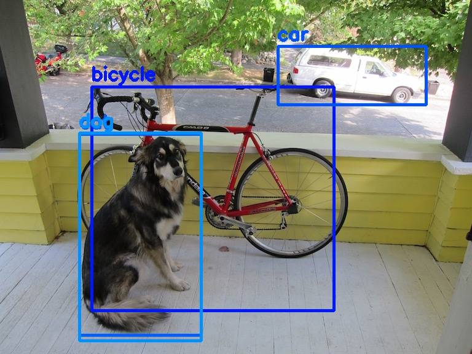

TensorRT MobilenetV2 SSD
====

## Description

Execute MobilenetV2 SSD inference via tensorrt

## Requirements
opencv >= 4.0
tensorrt >= 7.0

## Build
```bash
$ mkdir build && cd build
$ cmake ..
$ make
```
## Exec
```bash
$ cd build
$ ./trt_ssd /path/to/onnx/file /path/to/engine/file /path/to/image/file
```

## Reference
Create onnx file in this project [pytorch-ssd](https://github.com/qfgaohao/pytorch-ssd)